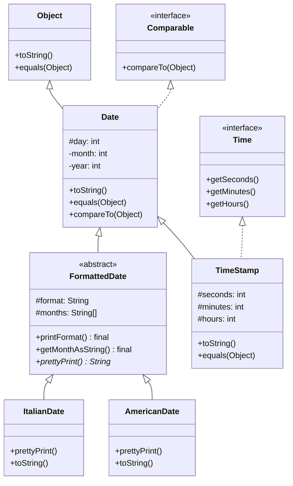

# 📌 Blocco 11: Lezione 12 / Slide T12 — *Inheritance and Polymorphism* & `MavenDate` (v3 con `FormattedDate`, `Time` e `TimeStamp`)

In questo blocco analizziamo in modo esaustivo i due pilastri più importanti dell'OOP in Java: l'**Ereditarietà** e il **Polimorfismo** ([T12 - Inheritance and Polymorphism.pdf](file:///home/wally/Documenti/GitHub/Programmazione-II/25-26/Teoria-e-Esercitazioni/Slides-20260902/T12%20-%20Inheritance%20and%20Polymorphism.pdf)).
Nel codice di [`Lezione12/MavenDate`](file:///home/wally/Documenti/GitHub/Programmazione-II/25-26/Teoria-e-Esercitazioni/Codice-20260902/Lezione12/MavenDate), la gerarchia evolve introducendo la classe astratta intermedia **[`FormattedDate`](file:///home/wally/Documenti/GitHub/Programmazione-II/25-26/Teoria-e-Esercitazioni/Codice-20260902/Lezione12/MavenDate/src/main/java/it/oop/core/FormattedDate.java)**, l'interfaccia **[`Time`](file:///home/wally/Documenti/GitHub/Programmazione-II/25-26/Teoria-e-Esercitazioni/Codice-20260902/Lezione12/MavenDate/src/main/java/it/oop/core/Time.java)**, la classe estesa **[`TimeStamp`](file:///home/wally/Documenti/GitHub/Programmazione-II/25-26/Teoria-e-Esercitazioni/Codice-20260902/Lezione12/MavenDate/src/main/java/it/oop/core/TimeStamp.java)** e l'interfaccia standard **`Comparable`** per l'ordinamento naturale degli array.

---

### 1. 📖 Concetti Teorici dalle Slide (Slide T12)

#### A. Ereditarietà di Classe (`extends`) e Riuso (Slide 1–17)
- **Relazione "IS-A" vs "HAS-A"**:
  - *Ereditarietà ("IS-A")*: un'auto *è un* veicolo (`Car extends Vehicle`); una data italiana *è una* data (`ItalianDate extends Date`).
  - *Composizione ("HAS-A")*: un'auto *ha un* motore (`Car` ha un campo `Engine`); una persona *ha una* data di nascita (`Person` ha un campo `Date`).
- **Ereditarietà Singola in Java**:
  - In Java **non esiste l'ereditarietà multipla tra classi** (a differenza del C++). Una classe può estendere al massimo **una sola classe genitore diretta** (`extends SuperClass`). Questo previene il cosiddetto *Diamond Problem*.
- **Overriding vs Overloading**:
  - *Method Overloading*: metodi nella stessa classe con lo stesso nome ma parametri diversi (risolto staticamente a compile-time).
  - *Method Overriding*: una sottoclasse riscrive l'implementazione di un metodo ereditato mantenendo **la stessa identica segnatura** (nome, tipi dei parametri, ordine) e un tipo di ritorno identico o covariante.
  - **L'Annotazione `@Override`**:
    Non è sintatticamente obbligatoria per far funzionare l'overriding, ma è una best practice fondamentale: dice al compilatore di verificare che quel metodo esista davvero nella superclasse, intercettando errori di battitura (es. scrivere per sbaglio `tostring()` con la 's' minuscola verrebbe segnalato come errore).
- **Costruttori ed Ereditarietà: La Parola Chiave `super`**:
  - ⚠️ **I costruttori NON vengono mai ereditati dalle sottoclassi**.
  - All'interno del costruttore di una sottoclasse, la prima istruzione deve essere una chiamata a `super(...)` oppure a un altro costruttore con `this(...)`.
  - Se il programmatore non scrive nulla, il compilatore inserisce automaticamente **`super();`** (invocazione del costruttore vuoto della superclasse).
  - ⚠️ **Trappola d'esame**: Se la superclasse non possiede un costruttore senza parametri (perché ne ha definito uno con parametri e non ha aggiunto quello di default), omettere `super(...)` genera un **Compile-Time Error**!
  - `super.metodo()` permette inoltre di invocare l'implementazione originaria della superclasse, bypassando l'override locale.
- **Classi e Metodi `final`**:
  - `final class`: non può essere estesa da nessun'altra classe (es. `String`, `Integer`).
  - `final method`: non può essere sovrascritto (*overridden*) da nessuna sottoclasse.

---

#### B. La Classe Radice Universale: `java.lang.Object` (Slide 18–31)
- *«The One Ring»*: in Java qualsiasi classe estende implicitamente `java.lang.Object`. Se una classe non specifica `extends`, estende direttamente `Object`.
- **I Metodi Universali di `Object`**:
  - `public String toString()`: rappresentazione testuale (`NomeClasse@hashcode`).
  - `public boolean equals(Object obj)`: confronto semantico (di default confronta l'identità con `==`).
  - `public int hashCode()`: valore hash associato all'oggetto.
  - `public final Class<?> getClass()`: restituisce il descrittore a runtime del tipo della classe.
- **Il Contratto Formale di `equals`**:
  Ogni implementazione di `equals` deve rispettare 5 proprietà matematiche:
  1. *Riflessiva*: `x.equals(x)` è sempre `true`.
  2. *Simmetrica*: `x.equals(y)` ritorna `true` se e solo se `y.equals(x)` ritorna `true`.
  3. *Transitiva*: se `x.equals(y)` è `true` e `y.equals(z)` è `true`, allora `x.equals(z)` è `true`.
  4. *Consistente*: invocazioni multiple producono lo stesso risultato finché lo stato non muta.
  5. *Non-Nullità*: per qualsiasi `x != null`, la chiamata `x.equals(null)` **deve restituire `false`** senza lanciare eccezioni.

---

#### C. Polimorfismo e Dynamic Method Dispatch (Late Binding) (Slide 32–50)
- **Principio di Sostituzione di Liskov (LSP)**:
  Se $S$ è sottotipo di $T$, qualsiasi porzione di codice scritta per interagire con $T$ deve poter operare in modo trasparente e corretto con un'istanza di $S$.
- **Tipo Statico vs Tipo Dinamico**:
  ```java
  Date d = new ItalianDate(1, 1, 1970);
  ```
  - **Tipo Statico (a Compile-Time)**: è il tipo dichiarato della variabile reference (`Date`). Il compilatore accetta solo invocazioni a metodi e accessi a campi definiti nella classe `Date`.
  - **Tipo Dinamico (a Runtime)**: è il tipo effettivo dell'oggetto allocato nello Heap (`ItalianDate`).
- **Dynamic Method Dispatch (Late Binding)**:
  Quando a runtime viene eseguita una chiamata a un metodo d'istanza (es. `d.toString()`), la JVM consulta la **Virtual Method Table (vtable)** dell'oggetto concreto nello Heap e seleziona **la versione del metodo definita dal Tipo Dinamico**!
  Non importa che `d` sia dichiarata come `Date`: verrà eseguito il `toString()` specializzato di `ItalianDate`.
- **Regole di Conversione di Tipo (Casting tra Oggetti)**:
  - **Upcasting (verso la superclasse)**:
    `Date d = new ItalianDate(...);` $\implies$ **Implicito, automatico e sempre sicuro al 100%**.
  - **Downcasting (verso la sottoclasse)**:
    `ItalianDate id = (ItalianDate) d;` $\implies$ **Esplicito obbligatorio**.
    - Se l'oggetto concreto nello Heap è effettivamente un'istanza compatibile, il cast ha successo.
    - Se l'oggetto concreto nello Heap è di tipo diverso (es. un `Date` generico o un `AmericanDate`), la JVM interrompe l'esecuzione e lancia una **`ClassCastException`**!
  - **Downcasting Sicuro con `instanceof`**:
    Per evitare crash a runtime si verifica preventivamente la compatibilità:
    ```java
    if (d instanceof ItalianDate) {
        ItalianDate id = (ItalianDate) d;
    }
    ```

---

### 2. 💻 Evoluzione del Codice: [`Lezione12/MavenDate`](file:///home/wally/Documenti/GitHub/Programmazione-II/25-26/Teoria-e-Esercitazioni/Codice-20260902/Lezione12/MavenDate)

In `Lezione12` la gerarchia del progetto diventa ricca e completa:



#### 1. L'Interfaccia `Comparable` in [`Date.java`](file:///home/wally/Documenti/GitHub/Programmazione-II/25-26/Teoria-e-Esercitazioni/Codice-20260902/Lezione12/MavenDate/src/main/java/it/oop/core/Date.java)
`Date` implementa l'interfaccia standard `java.lang.Comparable` per consentire l'ordinamento naturale:
```java
public class Date implements Comparable {
    ...
    @Override
    public int compareTo(Object other) {
        Date otherAsDate = (Date) other;
        int diff = this.year - otherAsDate.getYear();
        if (diff != 0) return diff;
        diff = this.month - otherAsDate.getMonth();
        if (diff != 0) return diff;
        return this.day - otherAsDate.getDay();
    }
}
```
*Logica di confronto*: confronta prima gli anni, se uguali confronta i mesi, se uguali confronta i giorni. Restituisce un intero negativo se `this < other`, zero se uguali, positivo se `this > other`.

---

#### 2. L'Astrazione con Classe Astratta: [`FormattedDate.java`](file:///home/wally/Documenti/GitHub/Programmazione-II/25-26/Teoria-e-Esercitazioni/Codice-20260902/Lezione12/MavenDate/src/main/java/it/oop/core/FormattedDate.java)
Centralizza i dati di formattazione evitando duplicazioni tra `ItalianDate` e `AmericanDate`:
```java
public abstract class FormattedDate extends Date {
    protected final String format;
    protected final String[] months;

    public FormattedDate(int day, int month, int year, String format, String[] months) {
        super(day, month, year);
        this.format = format;
        this.months = months;
    }

    // Metodi final: le sottoclassi non possono sovrascriverli (Template Method Pattern)
    public final String printFormat() { return format; }
    public final String getMonthAsString() { return months[getMonth() - 1]; }

    // Metodo astratto: DEVE essere implementato dalle sottoclassi concrete
    public abstract String prettyPrint();
}
```

---

#### 3. Ereditarietà Multipla di Tipo: [`TimeStamp.java`](file:///home/wally/Documenti/GitHub/Programmazione-II/25-26/Teoria-e-Esercitazioni/Codice-20260902/Lezione12/MavenDate/src/main/java/it/oop/core/TimeStamp.java)
Mostra come combinare l'estensione di una classe concreta con l'implementazione di un'interfaccia:
```java
public class TimeStamp extends Date implements Time {
    protected final int seconds;
    protected final int minutes;
    protected final int hours;

    public TimeStamp(int seconds, int minutes, int hours, int day, int month, int year) {
        super(day, month, year);
        this.seconds = seconds;
        this.minutes = minutes;
        this.hours = hours;
    }

    @Override
    public String toString() {
        // Riusa il toString() della superclasse aggiungendo l'orario con zero-padding a due cifre:
        return String.format("%s[%02d:%02d:%02d]", super.toString(), hours, minutes, seconds);
    }

    @Override
    public boolean equals(Object other) {
        // 1. Verifica prima l'uguaglianza della data con super.equals():
        if (super.equals(other) == false) return false;
        if (!(other instanceof TimeStamp)) return false;
        TimeStamp otherAsTimeStamp = (TimeStamp) other;
        // 2. Poi verifica l'orario:
        return hours == otherAsTimeStamp.getHours() &&
               minutes == otherAsTimeStamp.getMinutes() &&
               seconds == otherAsTimeStamp.getSeconds();
    }
}
```

---

#### 4. Dimostrazione Pratica in [`MainDate.java`](file:///home/wally/Documenti/GitHub/Programmazione-II/25-26/Teoria-e-Esercitazioni/Codice-20260902/Lezione12/MavenDate/src/main/java/it/oop/ui/MainDate.java)
```java
Time ts1 = new TimeStamp(0, 0, 10, 10, 11, 2025);
System.out.println(ts1.toString()); // Esegue TimeStamp.toString() tramite Late Binding!

// ts1.getDay(); // COMPILE-TIME ERROR: il tipo statico Time non possiede il metodo getDay()!
System.out.println(((Date) ts1).getDay()); // OK: cast esplicito a Date!

Date[] arr = { ts2, itDate, new Date(9, 9, 2025) };
Arrays.sort(arr); // Ordina l'array eterogeneo grazie a compareTo()!
System.out.println(Arrays.toString(arr));
```
**Output a video prodotto dall'ordinamento polimorfico**:
```text
[y2025m9d9, 3/11/2025, y2025m11d10[10:00:00]]
```
- L'ordinamento colloca correttamente prima il 9 settembre, poi il 3 novembre (`itDate`) e infine il 10 novembre (`TimeStamp`).
- In fase di stampa, ciascun elemento viene formattato dal **proprio** metodo `toString()` dinamico.

---

> [!NOTE]
> Con la **Lezione 12** abbiamo analizzato la gerarchia completa di ereditarietà, l'overriding con `super`, il late binding, la classe astratta `FormattedDate` e l'ordinamento con `Comparable`.
> 
> Il prossimo blocco è la **Lezione 13 / Slide T13: *Abstract Classes and Interfaces***:
> - Differenze ontologiche e strutturali tra **Classi Astratte** e **Interfacce**.
> - Metodi `default` e metodi `static` nelle interfacce (Java 8+).
> - Ereditarietà multipla tramite interfacce e risoluzione dei conflitti (*Diamond Problem* sui metodi default).
> - Evoluzione di `MavenDate` in `Lezione13`:
>   - La classe `Date` viene ripensata per gestire il calendario completo.
>   - Analisi delle nuove interfacce e classi di supporto.

**Dammi conferma per aprire la Lezione 13 / T13 e analizzare a fondo Classi Astratte e Interfacce!**
